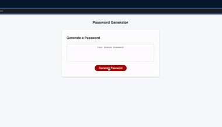

# Homework 03: Password Generator

## Description 

For this week's homework, we were provided with starter code to mainly focus on the Javascript to create a password generator using the tools and elements that we've learned so far. In all honesty, some elements I had to research on my own as we haven't learned them yet in order to create this project. Although Javascript is to say, more **complicated** and **confusing** than HTML or CSS, I had a great time learning a different language that I've never thought could do what it does. Now, when I visit websites and click on a function, without even noticing, I say "Hey, that's Javascript right there!"

As always, here is the **User Story** and the **Acceptance Criteria**:

## User Story

```
AS AN employee with access to sensitive data
I WANT to randomly generate a password that meets certain criteria
SO THAT I can create a strong password that provides greater security
```

## Acceptance Criteria

```
GIVEN I need a new, secure password
WHEN I click the button to generate a password
THEN I am presented with a series of prompts for password criteria
WHEN prompted for password criteria
THEN I select which criteria to include in the password
WHEN prompted for the length of the password
THEN I choose a length of at least 8 characters and no more than 128 characters
WHEN asked for character types to include in the password
THEN I confirm whether or not to include lowercase, uppercase, numeric, and/or special characters
WHEN I answer each prompt
THEN my input should be validated and at least one character type should be selected
WHEN all prompts are answered
THEN a password is generated that matches the selected criteria
WHEN the password is generated
THEN the password is either displayed in an alert or written to the page
```

## Installation 

I've provided my Github Repo and Github Pages to this project to enjoy generating a password if you need one:
- Github Repo: https://github.com/jasonchun7/hw-3-password-generator
- Github Pages: https://jasonchun7.github.io/hw-3-password-generator/

## Usage

The UI and UX is relatively simple and easy to use, thanks to the starter code that designed everything for us using CSS:


Once you click on the red "Generate Password" button, then you're prompted to enter a value between 8 and 128.


`Note:` If you don't input any value and proceed, an alert will trigger informing that you need to input a value.


Once you've done that, then it asks if you want lowercase and uppercase letters, any numbers, and special characters. 


`Note:` If you don't choose any criteria, then an alert will trigger informing that you need to choose at least one.



## Credits 

It wasn't easy creating a password generator from scratch, even with the HTML and CSS already provided to us. I've referenced most of my code from Jamie Rachael who's done a Password-Generator like this one as an assignment. 
- Here is her Github Repo: https://github.com/jamierachael/Password-Generator